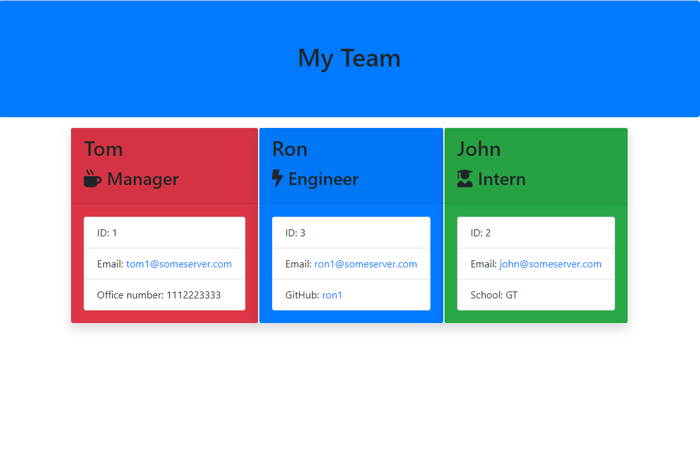
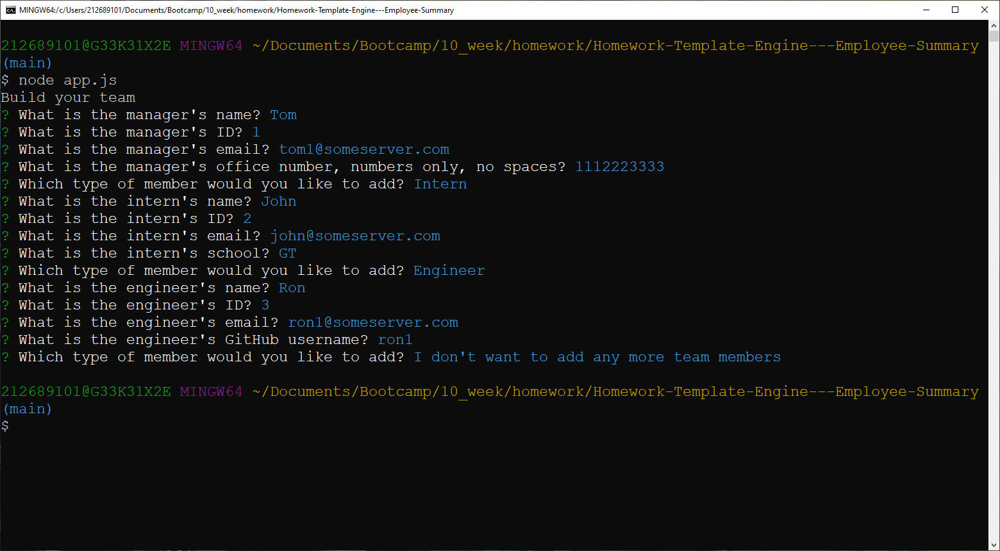

# Homework-Template-Engine---Employee-Summary

# Description
Build a software engineering team generator command line application. The application will prompt the user for information 
about the team manager and then information about the team members. The user can input any number of team members, and they may be a 
mix of engineers and interns. This assignment must also pass all unit tests. When the user has completed building the team, the 
application will create an HTML file that displays a nicely formatted team roster based on the information provided by the user. 
Following the [common templates for user stories](https://en.wikipedia.org/wiki/User_story#Common_templates), we can frame this challenge as follows:

# Request 
As a manager
I want to generate a webpage that displays my team's basic info
so that I have quick access to emails and GitHub profiles

# Screenshot of HTML

# Screenshot of Bash Input

# Guidelines
* Use the [Inquirer npm package](https://github.com/SBoudrias/Inquirer.js/) to prompt the user for their email, id, and specific 
information based on their role with the company. For instance, an intern may provide their school, whereas an engineer may 
provide their GitHub username.

* Your app will run as a Node CLI to gather information about each employee.

In the `Develop` folder, there is a `package.json`, so make sure to `npm install`.
The dependencies are, [jest](https://jestjs.io/) for running the provided tests, and [inquirer](https://www.npmjs.com/package/inquirer) 
for collecting input from the user.
There are also unit tests to help you build the classes necessary.

It is recommended that you follow this workflow:
1. Run tests
2. Create or update classes to pass a single test case
3. Repeat

🎗 Remember, you can run the tests at any time with `npm run test`
It is recommended that you start with a directory structure that looks like this:

lib/           // classes and helper code  
output/        // rendered output  
templates/     // HTML template(s)  
test/          // jest tests  
  Employee.test.js  
  Engineer.test.js  
  Intern.test.js  
  Manager.test.js  
app.js         // Runs the application  